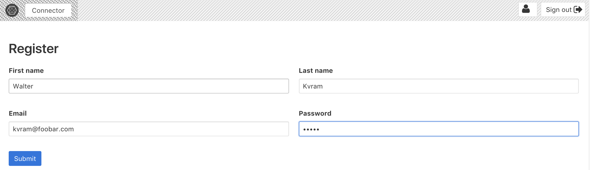
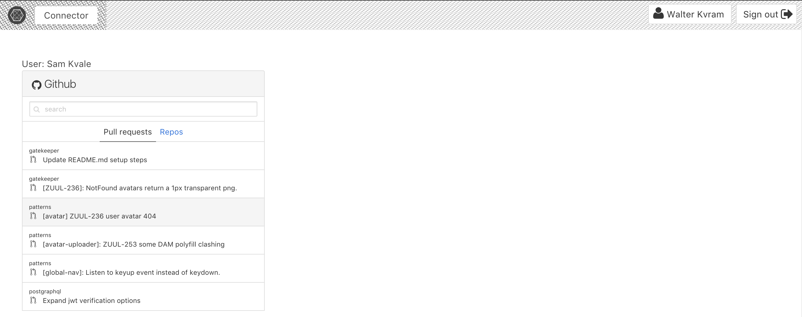

React Postgraphile
----

### Why?

I wanted to learn about Graphql and JWT tokens in Postgres

### What is it

A React app communicating with a Postgresql database
Using React-Apollo and Postgraphile's API generation.

```
    .+------+     +------+     +------+     +------+.
  .' |    .'|    /|     /|     |\     |\    |`.    | `.
 +---+--+'  |   +-+----+ |     | +----+-+   |  `+--+---+
 |   |  |   |   | |    | |     | |    | |   |   |  |   |
 | React|  <->  |Apollo| |<-> Postgraphile <-> Postgresql
 |.'    | .'    |/     |/       \|     \|    `. |   `. |
 +------+'      +------    \     +------+      `+------+
                            \
                             \ +------+
                               |\     |\
                               | +----+-+
                               | |    | |
                               .Github API
                                \|     \|
                                 +------+
```

Creating users and and authenticate with JWTs in Postgres.
Add a Github auth token and manage your Pull Requests / Repos

### You'll need
* [Postgresql](https://www.postgresql.org/download/)
* [Postgraphile](https://www.graphile.org/postgraphile) `yarn global add postgraphile` or `npm install -g postgraphile`
* react-postgraphile `git clone https://github.com/skvale/react-postgraphile`

### Starting it
```bash
cd react-postgraphile
```

Start Postgres

```bash
# for MacOS
brew services start postgres
# or
# postgres -D /usr/local/var/postgres
```

Create a database:

```bash
createdb react_postgraphile
```
Populate it

```bash
psql -f database/create.sql -d react_postgraphile
```

Start Postgraphile to create a Graphql layer over the created database

```bash
yarn run postgraphile
```

You can check your Graphql out at [localhost:5000/graphql](http://localhost:5000/graphql)

Run the React app in a new terminal

```bash
yarn start
```

and open [localhost:1234](http://localhost:1234) to see:



Registering a user creates a user as well as a jwt token and stores the token as a cookie called `jwt_token`.  Apollo adds that token to the header requests

```js
const authLink = token =>
  setContext((_, { headers }) => ({
    headers: {
      ...headers,
      ...token ? {Authorization: `Bearer ${token}`} : {}
    }
  }))
```

and Postgraphile uses that to know which user you are.

When the app runs the query

```js
export default graphql(gql`
{
  currentPerson {
    fullName
  }
}
`)(App)
```
Postgres gets the user identified by the jwt token on the request.  No API server, just a database function.

```sql
create function react_postgraphile.current_person() returns react_postgraphile.person as $$
  select *
  from react_postgraphile.person
  where id = current_setting('jwt.claims.person_id')::integer
$$ language sql stable;
```

 and passes it into the component.


